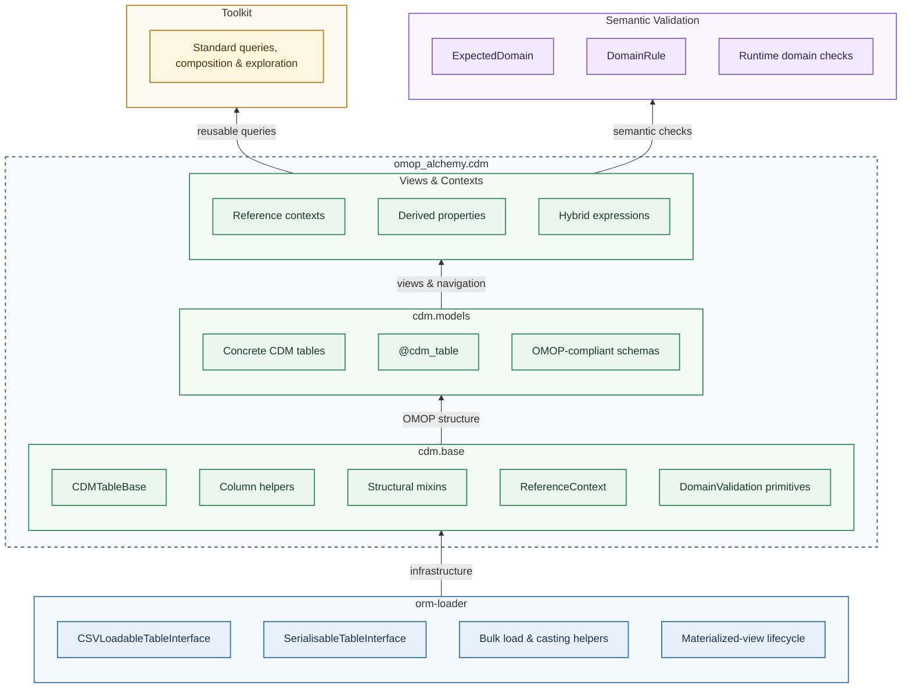

# Layered Architecture

OMOP Alchemy is built as a **deliberately layered system**.

Each layer adds capability while preserving the guarantees of the layers beneath it. The core layers build upward from generic infrastructure to OMOP-aware views; Toolkit and Semantic Validation build on those views independently.

The result is a system that is:

- composable
- inspectable
- safe for both ETL and analytics

---

## The Layer Stack

### Layer responsibilities

| Layer | Purpose | Responsibilities | Boundary and examples |
| --- | --- | --- | --- |
| **orm-loader (L0)** | Ingestion and infrastructure | CSV loading; bulk inserts; type casting; serialization; materialized-view definition and lifecycle operations | Domain-agnostic: it does not understand OMOP concepts, vocabularies, or clinical meaning. OMOP Alchemy may provide a selectable and logical row identity, while applications own view collections, dependency policy, and deployment. [CSVLoadableTableInterface](https://australiancancerdatanetwork.github.io/orm-loader/loaders/) [SerialisableTableInterface](https://australiancancerdatanetwork.github.io/orm-loader/tables/serialisable_table/) [Materialized views](https://australiancancerdatanetwork.github.io/orm-loader/tables/mat_view/) |
| **cdm.base (L1)** | Structural OMOP semantics | Common table structure; required and optional column patterns; reusable mixins; reference relationship mechanics; domain validation primitives | Defines OMOP’s shape, not its analytical meaning. Answers: “What does a valid OMOP table look like?” [CDMTableBase](./base.md); [PersonScoped](./columns.md); [ReferenceContext](./relationships.md) |
| **cdm.models (L2)** | Concrete OMOP tables | Actual CDM tables; exact column layouts; primary and foreign keys; official OMOP schemas | Safe for ETL and bulk loading; avoids eager relationships and analytical helpers. Example: [Person](../models/clinical/person.md) |
| **Views & Contexts (L3)** | Navigation and analysis | Reference relationships; derived properties; hybrid expressions; query-friendly helpers | Designed for interactive use, not ingestion: *tables are for pipelines; views are for people.* [PersonContext](../models/clinical/person.md); [PersonView](../models/clinical/person.md) |
| **Toolkit (L4)** | Reusable clinical queries and composition | Standard query contracts; vocabulary and concept resolution; event and episode composition; reusable analytical projections | Consumes CDM models and views, adding interpretation and retrieval rules without replacing models or hiding database access. [Toolkit overview](../toolkit/index.md); [Query contracts](../toolkit/query-contracts.md) |
| **Semantic Validation (L5)** | Explicit semantic expectations | Declared domain expectations; inspectable rules; runtime advisory checks | Non-blocking and non-mutating; safe to skip or run interactively. Answers: “Does this object reference the kinds of concepts I think it does?” [ExpectedDomain](../validation/index.md) |

### Directional guarantees

The dependency direction is intentionally one-way: higher layers may use lower layers, but lower layers never import higher layers. In the diagram, arrows show capability building upward from the foundation; Toolkit and Semantic Validation are peers rather than dependencies of one another.

* lower layers never import higher layers
* ETL code never depends on analytical helpers
* validation never mutates state

This guarantees:

* predictable ingestion
* expressive analysis
* minimal coupling
* documentation that stays aligned with code

### Why this separation matters

Implementations that collapse these concerns into a single ORM layer will tend to produce:

* accidental joins in ETL
* brittle analytical code
* hard-to-debug semantics
* documentation drift
