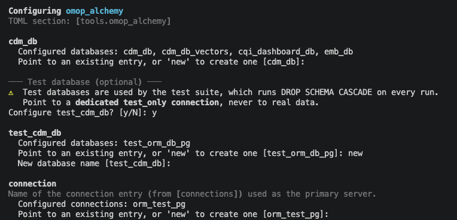
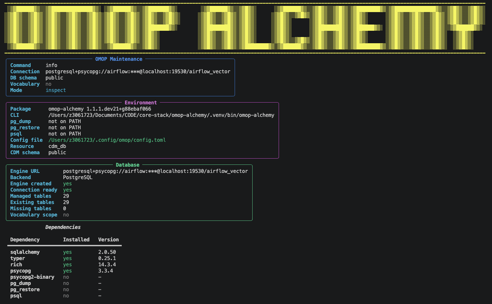

# Configuration

OMOP_Alchemy reads all database connection and schema settings from [oa_configurator](https://github.com/AustralianCancerDataNetwork/oa-configurator)

## Minimal config

Run the interactive configure command to set up the CDM database connection and write `~/.config/omop/config.toml`:

```bash
omop-config configure omop_alchemy
```

This prompts for connection details (host, dialect, credentials) and schema name, then saves them under the canonical database name `cdm_db` that all OMOP stack packages recognise.

The default location for this file is `~/.config/omop/config.toml`



The resulting TOML will look like:

```toml
[connections.cdm]
dialect       = "postgresql+psycopg"
host          = "localhost"
port          = 5432
user          = "omop"
password      = "changeme"
database_name = "omop_cdm"
test_only     = false

[databases.cdm_db]
kind       = "cdm"
connection = "cdm"
cdm_schema = "omop"

[tools.omop_alchemy]
cdm_db = "cdm_db"
```

You can also write or edit this file manually. It follows the `oa-configurator` pattern of [physical]->[logical] resource definition, where one connection may serve multiple databases, and each application may define its own database resource, or choose to cross reference an existing one that will be resolved upon connection in the consuming application.

## CDM table roles

OMOP_Alchemy tags every table with a logical role, matching the [OMOP CDM v5.4](https://ohdsi.github.io/CommonDataModel/cdm54.html)
categories:

- **Clinical/derived tables** (`Role.PRIMARY`):
    - All other tables not captured by the configurations below
    - Controlled by `cdm_schema` in the configuration.
- **Vocabulary tables** (`Role.VOCAB`):
    - `concept`, `concept_ancestor`, `concept_class`, `concept_relationship`, `concept_synonym`, `domain`, `drug_strength`, `relationship`, `source_to_concept_map`, `vocabulary`
    - Controlled by `vocab_schema` in the configuration.
- **Results/analytics tables** (`Role.RESULTS`):
    - `cohort`, `cohort_definition`
    - Controlled by `results_schema` in the configuration.


Each role folds back to `cdm_schema` when its own field is unset, so a minimal config needs no extra fields. 
Setting `vocab_schema`/`results_schema` routes just that role's tables elsewhere. See [oa_configurator's schema translate map guide](https://AustralianCancerDataNetwork.github.io/oa-configurator/architecture/#schema-translate-map) for how the routing itself works, and [Common Use Cases](common-use-cases.md) for worked examples of splitting these onto different schemas or servers.

!!! info "Misconfiguration prevention"
    Misconfiguring which schema a role points at doesn't corrupt data. [`oa-configurator`'s schema provenance guard](https://AustralianCancerDataNetwork.github.io/oa-configurator/architecture/#schema-provenance-guard) refuses the DDL.

## Vocabulary loading

If you plan to load OMOP vocabulary from Athena CSV files, add the path to `[tools.omop_alchemy]`:

```toml
[tools.omop_alchemy]
cdm_db             = "cdm_db"
athena_source_path = "/path/to/athena/csvs"
```

This may be edited directly, set interactively in the `omop-config configure omop_alchemy` process, or set directly using the CLI.

## Verify

```bash
omop-alchemy info
```

This prints the resolved config file path, connection details, and schema. A successful run confirms that OMOP_Alchemy can reach your database.



## Multiple instances

Note that postgres integration tests in this library and others following the `oa-configurator` utility may perform destructive actions and therefore require their own test-enabled configuration. This is typically only required for development use-cases. Test database configuration is separate to the inclusion of multiple CDM database connections (e.g. for staging/production). To configure a second CDM database, create it under its own name and point the field's own flag at it:

```bash
omop-config databases add cdm_db_prod --kind cdm --connection cdm_prod
omop-config configure omop_alchemy --cdm-db cdm_db_prod
```

This creates `cdm_db_prod` without touching the existing `cdm_db`. There is no "default" toggle to flip afterward; each deployment's `configure` call names the entry it wants directly.

See the [oa-configurator integration guide](https://AustralianCancerDataNetwork.github.io/oa-configurator/integration/#multiple-environments) for the full multi-environment guide.

## Further reading

- [Common Use Cases](common-use-cases.md): worked examples for vocab/results schema splits, a separate vocabulary server, and migrating an existing deployment's schema layout
- [oa_configurator quickstart](https://AustralianCancerDataNetwork.github.io/oa-configurator/quickstart/): full config reference, CLI walkthrough
- [oa_configurator integration guide](https://AustralianCancerDataNetwork.github.io/oa-configurator/integration/): multi-package setups
