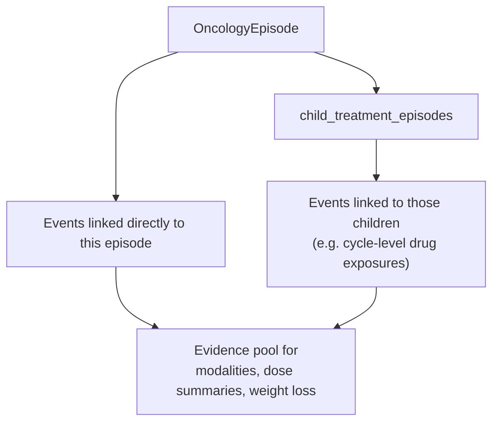

# Clinical analytics

Analytics packages combine domain-neutral retrieval with governed concept sets and clinical interpretation. This is where a procedure becomes evidence of radiotherapy, a series of measurements becomes a weight trajectory, or percentage weight loss becomes a severity grade.

## Oncology

`OncologyEpisode` is the main entry point for an episode-centred oncology analysis. Keep the object attached to its SQLAlchemy session while accessing properties that traverse related events or resolve vocabulary-backed concept groups:

```python
from sqlalchemy.orm import Session

from omop_alchemy.toolkit.analytics.oncology import OncologyEpisode

with Session(engine) as session:
    episode = session.get(OncologyEpisode, episode_id)
    if episode is None:
        raise LookupError(f"Unknown episode: {episode_id}")

    treatment_episodes = episode.child_treatment_episodes
    modalities = episode.structural_modalities
    sact = episode.sact_dose_summaries_by_drug_concept
    radiotherapy = episode.rt_dose_summaries_by_site
```

The episode includes events linked directly to it and events linked to its direct children. This supports a regimen whose drug exposures or procedures are recorded against cycle-level child episodes without flattening the episode hierarchy itself.



### Modality evidence

An episode can contain evidence for more than one treatment modality. `structural_modalities` and `concept_modalities` therefore return sets rather than forcing the record into a single label:

- structural evidence treats any linked drug exposure as SACT evidence and uses governed concepts for radiotherapy, surgery, and diagnostic or staging procedures;
- concept evidence requires drug exposures to belong to the governed SACT concept set as well.

Comparing the two sets makes source-structure and terminology disagreements visible:

```python
structural = episode.structural_modalities
governed = episode.concept_modalities

if structural != governed:
    review_episode_modality(episode.episode_id, structural, governed)
```

When a caller needs one value, `structural_modality` and `concept_modality` apply a deterministic order: radiotherapy, surgery, diagnostic or staging, then SACT. This is a stable tie-break for mixed evidence, not a statement of clinical importance. Use the plural properties when mixed treatment matters to the analysis.


The single-value properties return the first modality in this order for which the episode has evidence.

### Treatment summaries

`sact_exposures` contains linked exposures whose concepts belong to the governed SACT set. `sact_dose_summaries_by_drug_concept` groups them by drug concept; `sact_dose_summary` provides an all-SACT summary. The summary keeps source units and carries a `DoseEvaluability` result. Mixed units or missing quantities remain visible instead of being presented as a valid combined dose.

`rt_procedures` applies the governed radiotherapy procedure set. Site-grouped and whole-episode summaries expose dates, procedure and modifier concepts, counts, quantities, and dose evaluability. OMOP Procedure Occurrence does not provide a universal radiotherapy dose model, so these summaries preserve the available evidence for a site-specific policy rather than inferring one.

`OncologyProcedure` and `OncologyDrugExposure` expose the same governed classifications on individual facts. `OncologyEpisodeEvent` retains resolution diagnostics when a linked event cannot be loaded.

::: omop_alchemy.toolkit.analytics.oncology.OncologyEpisode
    options:
      members:
        - is_disease_episode
        - is_overarching
        - is_treatment_episode
        - is_treatment_regimen
        - is_treatment_cycle
        - primary_episode
        - child_treatment_episodes
        - structural_modalities
        - structural_modality
        - concept_modalities
        - concept_modality
        - child_treatment_episodes_by_modality
        - child_treatment_episodes_by_concept_modality
        - rt_procedures
        - rt_dose_summaries_by_site
        - rt_dose_summary
        - sact_exposures
        - sact_dose_summaries_by_drug_concept
        - sact_dose_summary
        - ctcae_weight_loss_grade
        - martin_weight_loss_grade
        - critical_weight_loss_grade
        - critical_weight_loss_summary

::: omop_alchemy.toolkit.analytics.oncology.RTDoseSummary
    options:
      members:
        - from_procedures

::: omop_alchemy.toolkit.analytics.oncology.SACTDoseSummary
    options:
      members:
        - from_exposures

## Body metrics

`WeightTrajectoryMixin` turns an episode's weight measurements and the person's height measurements into a normalised longitudinal view. Weight is converted to kilograms, height to centimetres, and measurements with missing or unrecognised units are excluded from calculations.

An episode that includes the mixin can produce a compact, tabular summary:

```python
summary = episode.weight_trajectory_summary()

print(summary["baseline_weight_kg"])
print(summary["latest_weight_kg"])
print(summary["pct_change_from_baseline"])
print(summary["pct_change_from_baseline_evaluable"])
```

The baseline is the first normalised weight in the resolved episode series and the latest weight is the last. Percentage change is negative for weight loss. A result separates its value from evaluability so that missing evidence is not confused with zero change.

`pct_change_over(days)` compares the latest reading with the earliest reading inside the requested look-back period. `pct_change_trajectory()` returns every normalised point relative to baseline. `sustained_loss()` asks whether the final consecutive readings all meet a configurable loss threshold. These are deliberately distinct questions; choose the one that matches the analysis rather than treating them as interchangeable summaries of weight loss.

Body-metric defaults resolve governed measurement and unit concepts. A deployment that uses local concepts can supply its own `BodyMetricRules` on the episode class.

::: omop_alchemy.toolkit.analytics.body_metrics.MeasurementReading
    options:
      members:
        - from_measurement

::: omop_alchemy.toolkit.analytics.body_metrics.WeightTrajectoryMixin
    options:
      members:
        - weight_readings
        - height_readings_cm
        - height_m
        - baseline_weight
        - latest_weight
        - baseline_bmi
        - baseline_bsa_mosteller_m2
        - pct_change_from_baseline
        - pct_change_over
        - pct_change_trajectory
        - sustained_loss
        - weight_trajectory_summary

## Adverse events

The adverse-event functions apply grading policy to an already calculated percentage change and, where available, BMI:

```python
from omop_alchemy.toolkit.analytics.adverse_events import (
    critical_weight_loss_grade,
)

grade = critical_weight_loss_grade(
    pct_change=-8.2,
    bmi=21.4,
)
```

`martin_weight_loss_grade()` applies the BMI-adjusted Martin et al. matrix. `ctcae_weight_loss_grade()` applies the CTCAE v5.0 physiological percentage-loss thresholds but does not infer intervention qualifiers such as hospitalisation, tube feeding, or parenteral nutrition. `critical_weight_loss_grade()` uses the Martin matrix when both percentage change and BMI are available and otherwise falls back to the percentage-only CTCAE-style grade.

All three return `None` when the inputs needed by that policy are unavailable. They do not retrieve measurements or choose a baseline; those decisions remain in the body-metric layer.

::: omop_alchemy.toolkit.analytics.adverse_events
