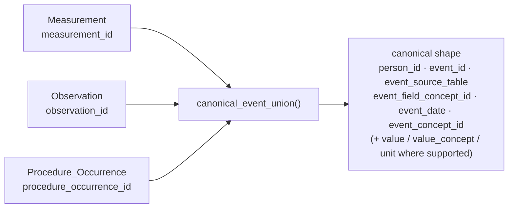

# Core services

The core package handles problems that have the same meaning in every clinical domain: resolving a source term to an OMOP concept, identifying an event across CDM tables, arranging events on a timeline, and converting measurements to comparable units.

Generic database lifecycle operations do not belong in the clinical toolkit. Use
[`orm-loader`](https://australiancancerdatanetwork.github.io/orm-loader/tables/mat_view/)
to define, create, refresh, index, and drop materialized views. OMOP Alchemy owns
the OMOP-specific query and row-grain decisions supplied to that infrastructure;
an application such as `omop-constructs` owns its registry, dependency policy,
and deployment orchestration. See [Materialized views](materialized-views.md) for
the integration boundary.

## Resolve source data to concepts

Suppose an intake system supplies the text `Adenocarcinoma of lung` rather than an OMOP concept ID. A resolver limits the eligible vocabulary rows and applies the same text normalisation when it builds its lookup and when it handles an incoming value:

```python
from omop_alchemy.toolkit.core.concepts import make_concept_resolver

resolver = make_concept_resolver(
    session,
    name="condition lookup",
    domain_id="Condition",
)

concept_id = resolver.lookup("Adenocarcinoma of lung")
```

Creating the resolver reads the vocabulary tables, so create it once for a mapping workflow and reuse it. `LookupSpec`, `LookupIndex`, and `ConceptResolver` expose the individual stages when you need to control indexed fields, normalisation, or resolver lifetime. `ConceptResolverRegistry` provides lazy construction and caching when an application maintains several lookups.

Concept groups answer the complementary question: whether a known concept belongs to a governed set. A resolved group supports both in-memory membership and a SQLAlchemy expression derived from the same specification, so filtering loaded objects and filtering in SQL do not require separate definitions.

Configuration-driven concept sets use `RuntimeConceptSetSpec`. It records exact and ancestral inclusions and exclusions without touching the database; see [Runtime concept sets](query-contracts.md#runtime-concept-sets) for the set semantics and current execution boundary.

## Resolve concepts to standard concepts

Most source concepts resolve to one standard concept. Some source concepts represent several clinical meanings, however, and OMOP maps those to several standard concepts. `standard_concept_mapping_select()` therefore returns one row per valid `Maps to` relationship rather than choosing one target:

```python
from datetime import date

from omop_alchemy.toolkit.core.concepts import (
    StandardConceptMappingSpec,
    standard_concept_mapping_select,
)

mapping_query = standard_concept_mapping_select(
    StandardConceptMappingSpec(
        source_concept_ids=(source_concept_id,),
        valid_on=date(2026, 1, 1),
    )
)

mapping_rows = session.execute(mapping_query).mappings().all()
```

Each row carries the source and standard concept identifiers, vocabularies, codes, and names alongside the relationship validity dates. Invalid relationships, invalid targets, non-standard targets, and other relationship types are excluded. A standard concept's `Maps to` self-map is returned normally.

Supplying `valid_on` makes the relationship and target date ranges part of the query, which is useful when a result must be reproducible against a dated vocabulary release. The query does not follow replacement relationships or `Maps to value`: those relationships answer different questions and should be handled by purpose-specific queries when a toolkit consumer needs them.

::: omop_alchemy.toolkit.core.concepts

## Identify events across CDM tables

A Measurement and a Procedure Occurrence may have the same numeric primary key. Code that combines tables must therefore carry the source table as part of event identity:

```python
from omop_alchemy.toolkit.core.events import ClinicalEventIdentity

measurement = ClinicalEventIdentity("measurement", 7)
procedure = ClinicalEventIdentity("procedure_occurrence", 7)

assert measurement != procedure
```

`ClinicalEventColumn` defines the common labels used when heterogeneous event tables are projected into one result. The required shape includes the person, table-scoped event identity, event date and datetime, clinical concept, and OMOP Field concept that identifies the source ID column. Optional labels cover numeric values, value concepts, and units.

`canonical_event_union()` turns supported event models into that shared shape. Measurement and Observation retain their value and unit columns; sources without those fields receive typed nulls so every branch of the union remains compatible:

```python
from omop_alchemy.cdm.model import (
    Measurement,
    Observation,
    Procedure_Occurrence,
)
from omop_alchemy.toolkit.core.events import canonical_event_union

events = canonical_event_union(
    Measurement,
    Observation,
    Procedure_Occurrence,
)

for event in session.execute(events).mappings():
    print(event["event_source_table"], event["event_id"], event["event_date"])
```

The projection resolves its ID, clinical concept, date, source table, and Field concept through stable CDM event metadata shared with episode-event resolution. Bare `Measurement`, `Observation`, and `Device_Exposure` classes remain lightweight mappings for ETL, while their analytical views provide reference context, domain validation, and episode-event resolution. Importing analytics modules cannot change either the Core projection metadata or the default resolution target. `UnsupportedClinicalEventModelError` is raised before SQL execution when no supported CDM definition exists.



Each source model contributes its own ID column and Field concept; branches without a value or unit receive typed nulls so the union stays one consistent shape regardless of which models are combined.

The [query contracts](query-contracts.md) explain how the canonical shape participates in episode attachment.

## Work with a patient timeline

The timeline adapter presents conditions, measurements, observations, and drug exposures as a single ordered sequence while retaining each row's source identity and value semantics. Use it when an application needs to display or serialise a patient's chronology rather than build a set-based analytical query.

The timeline has a dedicated guide with session requirements, event mappings, and extension points: [Patient timelines](../advanced/timelines.md).

## Convert body measurements

Body-size calculations require weights and heights to use consistent units. The default conversion rules use the unit concept recorded on each measurement:

```python
from omop_alchemy.toolkit.core.units import default_body_unit_conversion_rules

rules = default_body_unit_conversion_rules()
weight_kg = rules.normalize_weight_kg(180.0, rules.units.lb)
height_cm = rules.normalize_height_cm(70.0, rules.units.inch)
```

An unknown unit, a missing unit, or a missing value produces `None`; values are never passed through as though they were already normalised. Deployments with local unit concepts can construct `BodyUnitConversionRules` with their own `BodySizeUnitConcepts` mapping.

Clinical choices built on those conversions, including which measurements constitute baseline weight and how change is graded, belong to [`analytics.body_metrics`](analytics.md#body-metrics) and [`analytics.adverse_events`](analytics.md#adverse-events).

::: omop_alchemy.toolkit.core.units
