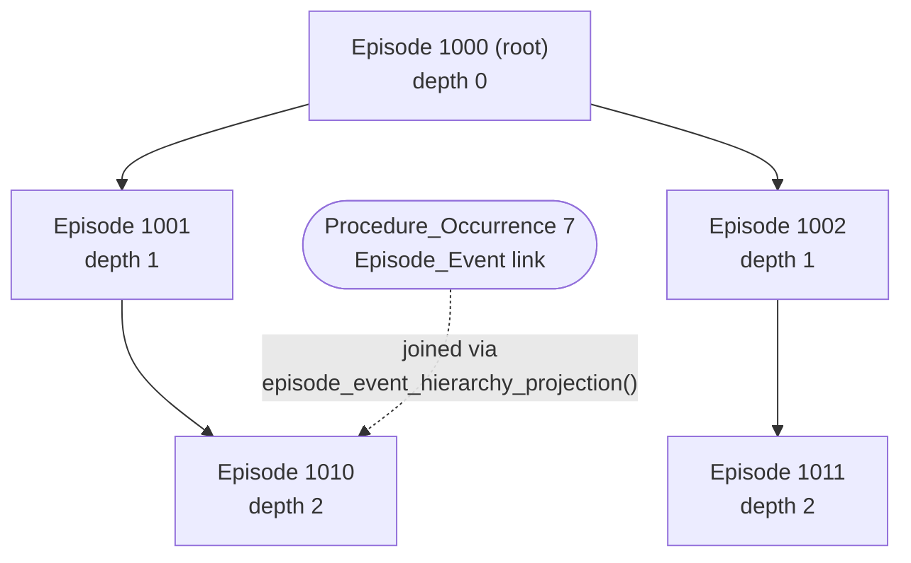

# Episodes

Episode APIs answer two related questions: how episodes relate to one another, and which clinical facts belong to an episode. They do not assume a specialty. Oncology-specific episode types compose these APIs with governed oncology concepts in the [analytics package](analytics.md#oncology).

## Retrieve facts from an episode

For a treatment episode, a common first task is to retrieve its linked drug exposures and group them by drug concept:

```python
from omop_alchemy.cdm.model.structural import EpisodeView
from omop_alchemy.toolkit.episodes.handling import DrugEpisodeMixin


class TreatmentEpisode(DrugEpisodeMixin, EpisodeView):
    _drug_concept_ids = treatment_drug_concept_ids


episode = session.get(TreatmentEpisode, episode_id)
if episode is None:
    raise LookupError(f"Unknown episode: {episode_id}")

exposures = episode.drug_exposures
summaries = episode.drug_exposure_summaries_by()
```

`drug_exposures` uses explicit `Episode_Event` links by default. `_drug_concept_ids` limits the rows to the concepts meaningful for this episode type, and `drug_exposure_summaries_by()` groups the selected rows by `drug_concept_id`. Pass a key function when another grouping, such as ingredient or regimen member, is more useful.

If rows have already been selected elsewhere, construct or group summaries directly:

```python
from omop_alchemy.toolkit.episodes.handling import (
    DrugExposureSummary,
    summarize_drug_exposures_by,
)

regimen_summary = DrugExposureSummary.from_exposures(
    regimen_exposures,
    group_key="regimen-a",
)

by_drug = summarize_drug_exposures_by(
    regimen_exposures,
    key=lambda exposure: exposure.drug_concept_id,
)
```

The generic summary reports counts, dates, source units, concepts, and a raw quantity total. A total is only clinically comparable when the source quantities have compatible meaning and units. Domain-specific summaries can attach `DoseEvaluability` to make that judgement explicit, as the oncology SACT and radiotherapy summaries do.

## Explicit links and date windows

An `Episode_Event` row is the strongest statement that a fact belongs to an episode, so linked facts are always retained. Some datasets do not populate these links consistently. A caller can opt into bounded date-window retrieval for drug exposures by setting `_include_window_drug_exposures = True` on its mixin class.

Window retrieval must be paired with a meaningful concept filter. Without one, every same-person drug exposure inside the dates is eligible. The generic helper deliberately defaults to explicit links only.

`episode_attachment_window()` provides a related bounded window for episode-attributable facts. Its lower bound is a configurable number of days before the episode start. Its upper bound is the recorded episode end, or a finite fallback after the start when the episode is open-ended. The finite fallback prevents an incomplete episode from absorbing the rest of a person's record.

## Understand unresolved episode links

`Episode_EventView.resolved_event` returns the linked analytical ORM row when the field concept and target row can be resolved, otherwise `None`. Measurement and Observation links resolve to `MeasurementView` and `ObservationView`; their bare table mappings remain available for lightweight ETL. `ResolvedEpisodeEvent` preserves the resolution behaviour and adds a diagnostic that distinguishes three cases:

- the field concept is not a recognised `ModifierFieldConcepts` value;
- the field concept is recognised but no ORM target class is registered for it; or
- the target row does not exist.

```python
from omop_alchemy.toolkit.episodes.handling import ResolvedEpisodeEvent

link = session.get(
    ResolvedEpisodeEvent,
    (episode_id, event_id, field_concept_id),
)

if link is not None and link.resolved_event is None:
    for diagnostic in link.event_resolution_diagnostics:
        logger.warning("%s: %s", diagnostic.kind, diagnostic.message)
```

Use `ResolvedEpisodeEventMixin` on an episode view when diagnostics should be available through `episode.episode_events` rather than through a separate query.

::: omop_alchemy.toolkit.episodes.handling

## Traverse an episode hierarchy

`canonical_episode_projection()` selects the stable structural fields without joining vocabulary tables. Pass `include_concept_label=True` when a result intended for inspection or presentation also needs `episode_concept_name`. The vocabulary lookup is optional: an episode remains in the result with a null label when its concept is zero, absent, or unavailable in a subset vocabulary.

```python
from omop_alchemy.toolkit.episodes.derivation import canonical_episode_projection

episodes = canonical_episode_projection(include_concept_label=True)
```

For a parent episode, `episode_descendants()` returns a recursive CTE containing the root at depth zero and each descendant at its distance from that root:

```python
from sqlalchemy import select

from omop_alchemy.toolkit.episodes.derivation import episode_descendants

hierarchy = episode_descendants(root_episode_id=episode_id)
statement = select(
    hierarchy.c.episode_id,
    hierarchy.c.episode_parent_id,
    hierarchy.c.depth,
).order_by(hierarchy.c.depth, hierarchy.c.episode_id)

rows = session.execute(statement).mappings().all()
```

Traversal follows parent IDs only within the same person and stops at a configurable maximum depth, which bounds malformed cyclic data. Set `include_root=False` when only descendants are needed. `direct_episode_relationship_projection()` provides a non-recursive parent-child result for callers that need one level only.

`episode_event_hierarchy_projection()` joins the hierarchy to `Episode_Event` and retains the root episode, the episode that owns the link, and its depth. This lets a caller include child-linked evidence without encoding a specialty-specific number of child levels:



The link at depth 2 is visible to code operating on the root at depth 0, without the caller having to know how many levels separate them.

## Describe episode attachment policy

The derivation package provides declarative types for code that assigns events to episodes. The types keep four choices visible: whether explicit links take precedence, whether fallback may return one or several episodes, which side of an anchor date is preferred, and how candidates within that preference are ranked.

For example, the following policy honours a valid explicit link and otherwise chooses one episode. Episodes that had started by the event date are considered before future episodes, and the nearest start date wins within that group:

```python
from omop_alchemy.toolkit.episodes.derivation import (
    EpisodeAttachmentPolicy,
    EpisodeWindowSpec,
    TemporalRankingSpec,
    TemporalSelectionPolicy,
    TemporalSidePreference,
)

attachment = EpisodeAttachmentPolicy.explicit_first_ranked
window = EpisodeWindowSpec(
    days_prior=90,
    open_end_fallback_days=365,
)
ranking = TemporalRankingSpec(
    policy=TemporalSelectionPolicy.nearest,
    stable_id_column="episode_id",
    side_preference=TemporalSidePreference.on_or_before_anchor,
)
```

Pass the policy, window, and—only for ranked fallback—ranking to `episode_attachment_queries()` with a canonical event projection. The builder validates explicit links by event ID, Field-concept discriminator, episode ID, and person; suppresses fallback only after a valid link; and returns deterministic attachments plus optional diagnostics. All-in-window fallback accepts the window but rejects a ranking because it deliberately retains every admitted episode. `episode_window_predicate()`, `temporal_order_expressions()`, and `temporal_row_number()` remain available when a query needs the individual portable SQL pieces. Date arithmetic is implemented for PostgreSQL and SQLite; compiling it for another dialect fails rather than assuming PostgreSQL syntax.

See [Query contracts](query-contracts.md) for the complete result shape, attachment example, boundaries, repeated-observation selection, and the distinction between absolute-nearest and already-started-first ranking.

::: omop_alchemy.toolkit.episodes.derivation
