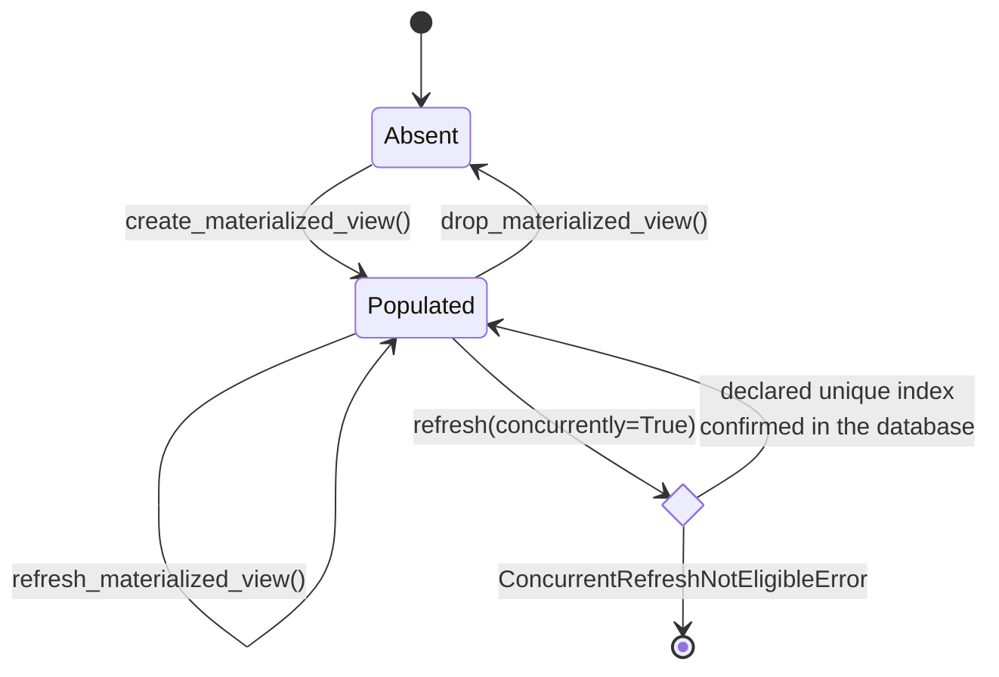

# Materialized views

Materialized views are useful when an analytical query is expensive but its results can be refreshed on a controlled schedule. The lifecycle helpers in OMOP Alchemy keep every operation tied to an explicit PostgreSQL schema and view name. This prevents a connection's search path from deciding which object is created, refreshed, indexed, or dropped.

The following view stores one row for each event selected by an application query:

```python
import sqlalchemy as sa

from omop_alchemy.toolkit.core.materialization import (
    MaterializedViewIndex,
    MaterializedViewSpec,
    MaterializedViewTarget,
    create_materialized_view,
    create_materialized_view_indexes,
)

event_query = sa.select(
    events.c.person_id,
    events.c.event_id,
    events.c.event_date,
)

event_view = MaterializedViewSpec(
    target=MaterializedViewTarget(
        schema="reporting",
        name="clinical_events",
    ),
    selectable=event_query,
    logical_identity=("person_id", "event_id"),
    indexes=(
        MaterializedViewIndex(
            name="clinical_events_identity_uq",
            columns=("person_id", "event_id"),
            unique=True,
        ),
    ),
)

with engine.begin() as connection:
    create_materialized_view(connection, event_view)
    create_materialized_view_indexes(connection, event_view)
```

The schema and view name are separate identifiers and are quoted by the PostgreSQL dialect. Index columns and index names are quoted in the same way. Applications should pass identifiers as plain strings; they should not add SQL quoting themselves.

Creation fails when the view or index name already exists. This makes a stale definition or incompatible existing index visible to the caller. A registry that has separately checked the existing object may opt into idempotent PostgreSQL DDL with `if_not_exists=True`.

## Refresh a populated view

A normal refresh replaces the contents while holding the PostgreSQL lock associated with `REFRESH MATERIALIZED VIEW`:

```python
from omop_alchemy.toolkit.core.materialization import refresh_materialized_view

with engine.begin() as connection:
    refresh_materialized_view(connection, event_view)
```

A concurrent refresh permits reads to continue, but PostgreSQL requires an eligible unique index on the populated view. Setting `concurrently=True` does not simply add SQL syntax. The helper first checks that the specification declares a simple unique index and then inspects PostgreSQL to confirm that an eligible unique index exists:

```python
with engine.begin() as connection:
    refresh_materialized_view(
        connection,
        event_view,
        concurrently=True,
    )
```

If either check fails, `ConcurrentRefreshNotEligibleError` is raised before the refresh statement is executed. The declaration does not substitute for creating the index, and an undeclared database index does not substitute for recording the operational requirement in the specification.



## Drop one qualified target

Dropping uses the same `MaterializedViewTarget` as creation and refresh:

```python
from omop_alchemy.toolkit.core.materialization import drop_materialized_view

with engine.begin() as connection:
    drop_materialized_view(connection, event_view)
```

The default is `DROP MATERIALIZED VIEW IF EXISTS` without `CASCADE`. Set `if_exists=False` when absence should be an error, or `cascade=True` when the caller has deliberately accounted for dependent database objects.

Database failures are raised as `MaterializationError`. Its `failure` attribute records the operation, qualified target, optional index name, reason, and original exception. The original database exception is also retained as the exception cause. Lifecycle helpers never print an error and continue within an aborted transaction.

The `engine.begin()` context used in these examples rolls the transaction back automatically when an exception leaves the block. If an application manages a `Connection` transaction manually, it must roll back after a database error before attempting another statement on that connection. Catching `MaterializationError` does not make an aborted PostgreSQL transaction usable again.

## Identity, indexes, and dependencies

`logical_identity` describes the complete output columns that distinguish rows in the materialized view. Construction fails if an identity or index refers to a column that the selectable does not expose. The identity is descriptive until a unique index or another database constraint enforces it, so applications should test its uniqueness against representative data before deployment.

`dependencies` records other qualified materialized views that must already exist. It is metadata for an application-owned registry or deployment planner; the single-view lifecycle helpers do not create, refresh, or drop dependencies automatically. This keeps orchestration policy, dependency order, and command-line behaviour in the system that owns the collection of views.

The DDL elements `CreateMaterializedView`, `CreateMaterializedViewIndex`, `RefreshMaterializedView`, and `DropMaterializedView` can be compiled with the PostgreSQL dialect when a deployment tool needs to inspect or record SQL without executing it.

## API reference

::: omop_alchemy.toolkit.core.materialization
